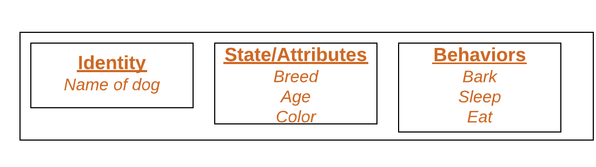
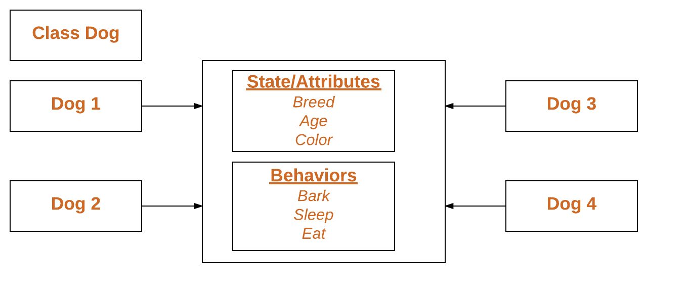

# 参考资料
python 是一门动态语言，Ducking Typing的概念遍布在其中。

   这个概念的名字来源于由James Whitcomb Riley提出的鸭子测试，“鸭子测试”可以这样表述：

    “当看到一只鸟走起来像鸭子、游泳起来像鸭子、叫起来也像鸭子，那么这只鸟就可以被称为鸭子。”

 在鸭子类型中，关注的不是对象的类型本身，而是它是如何使用的。

 现在来看看什么是协议吧，简单的说，在python中我需要调用你的某个方法，你正好有这个方法，这就是协议，比如在加法运算中，当出现加号（+）时，那么按照数值类型相关的协议，python会自动去调用相应对象的__add__()方法，这就是协议。

所以，就引出了协议。只要对象实现了某些特定的函数，就有特性。

对象: 是什么（与其他的区别)有什么，可以干什么
-   State: It is represented by attributes of an object. It also reflects the properties of an object.
-   Behavior: It is represented by methods of an object. It also reflects the response of an object with other objects.
-   Identity: It gives a unique name to an object and enables one object to interact with other objects.




```python
# Python program to
# demonstrate instantiating
# a class

class Dog:

	# A simple class
	# attribute
	attr1 = "mamal"
	attr2 = "dog"

	# A sample method
	def fun(self):
		print("I'm a", self.attr1)
		print("I'm a", self.attr2)

# Driver code
# Object instantiation
Rodger = Dog()

# Accessing class attributes
# and method through objects
print(Rodger.attr1)
Rodger.fun()

```


对象+协议
《python cookbook》

这个得看看,编码方式什么的

https://github.com/fluentpython/isis2json


>https://blog.51cto.com/u_11026142/1858863

>https://blog.hszofficial.site/TutorialForPython/

>https://zhuanlan.zhihu.com/p/220021357
